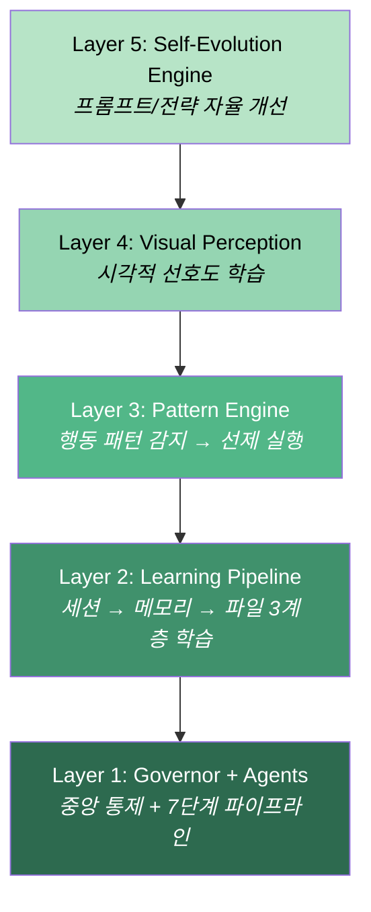
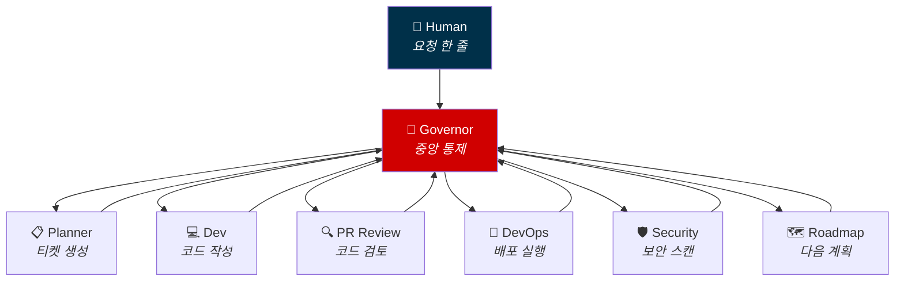
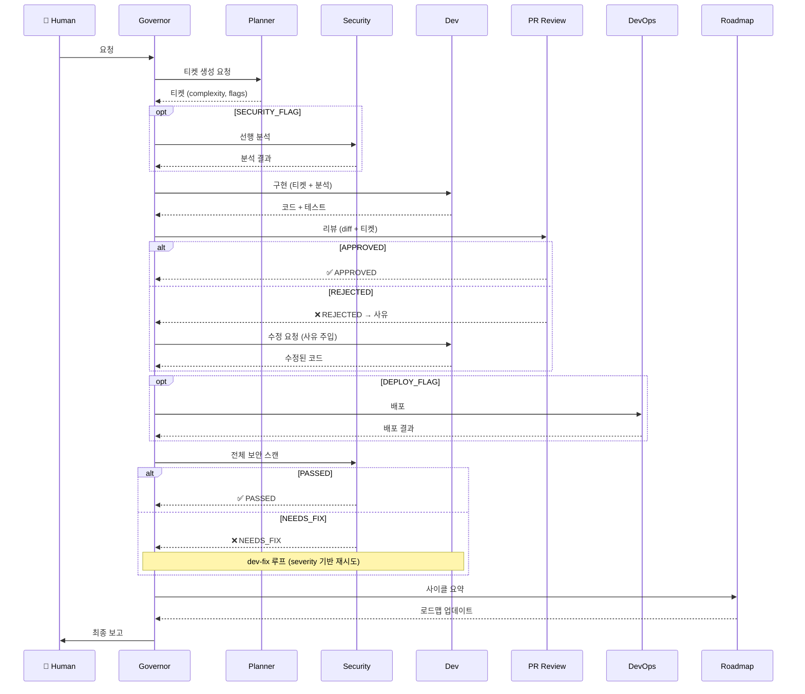
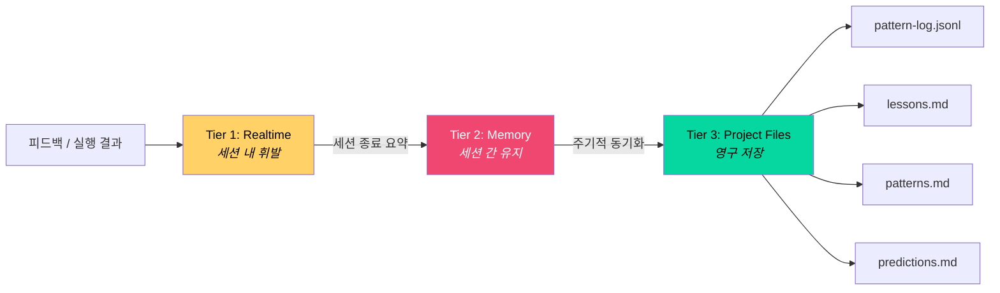

# Sentix Architecture — Mermaid Diagrams

> FRAMEWORK.md의 설계를 시각화한 다이어그램.
> GitHub에서 렌더링됩니다.

---

## 5-Layer Architecture

---

## Governor Hub-and-Spoke

---

## 파이프라인 흐름

---

## 학습 파이프라인 (3-Tier)

